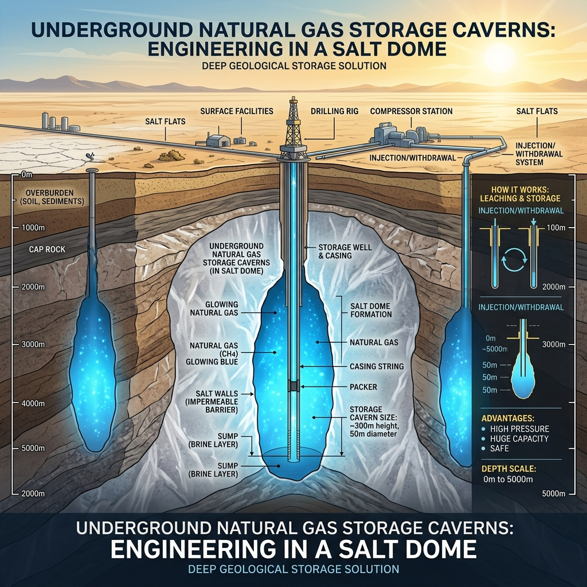
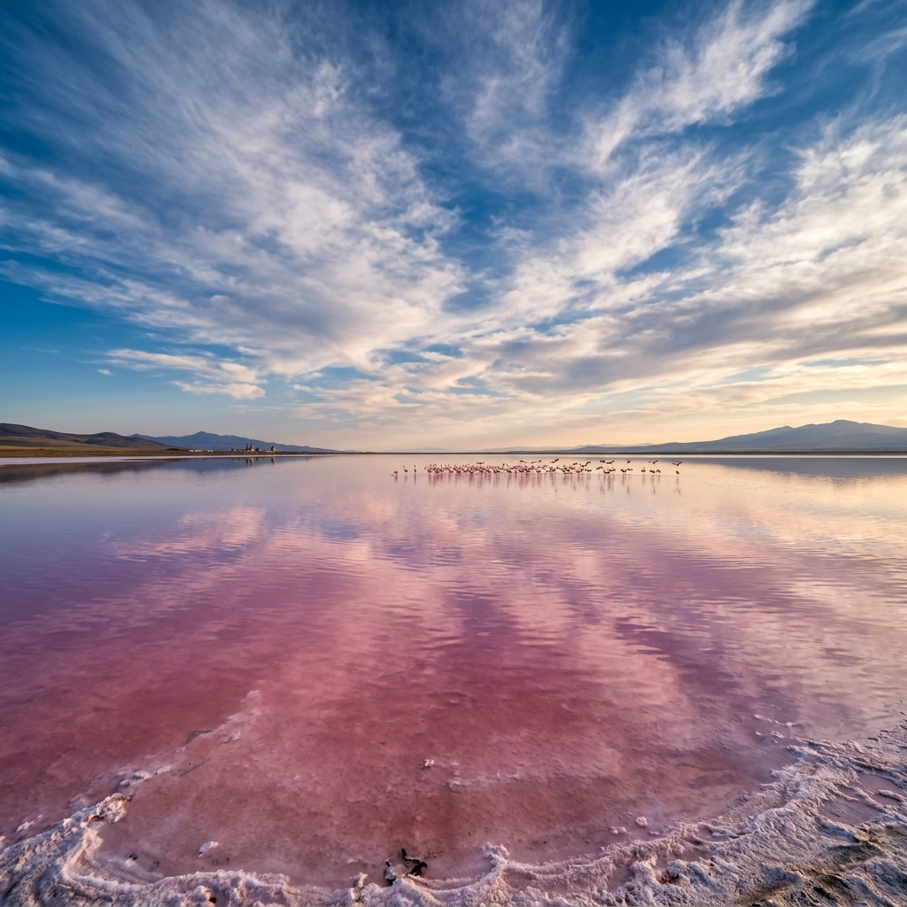
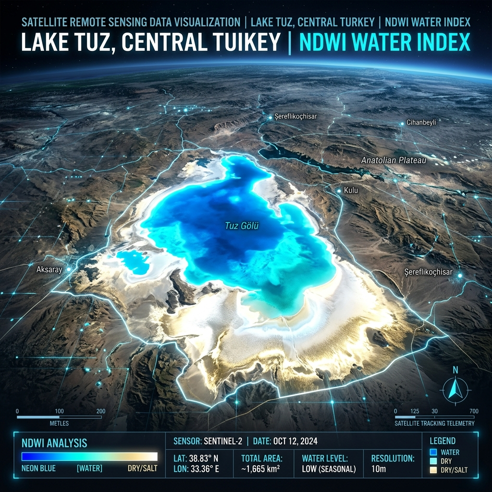

# 🌊 Tatta-Archive: Tuz Gölü Disiplinlerarası Araştırma Deposu

<div align="center">


**[🌐 Canlı Platform](https://arch-yunus.github.io/Tatta-Archive/)** · **[📊 Veri Setleri](./data/)** · **[🔬 Analiz Scriptleri](./scripts/)** · **[🤝 Katkıda Bulun](./CONTRIBUTING.md)**


*Tuz Gölü, Nisan ayı — Bahar ayna yansıması. Fotoğraf: Tatta-Archive*

</div>

---

> *"Hiçbir şeyin olmadığı uçsuz bucaksız bir beyazlıkta, doğanın en karmaşık jeolojik, biyokimyasal, mühendislik ve folklorik sistemleri çalışır."*

**Tatta-Archive**, Türkiye'nin en büyük ikinci gölü ve Yakın Doğu'nun en büyük hipersalin kapalı havzası olan **Tuz Gölü'nün** (Antik coğrafyacıların adlandırmasıyla *Tatta* — Τάττα) fiziki, kimyasal, biyolojik, mühendislik, endüstriyel, klimatolojik ve folklorik tüm katmanlarını inceleyen **disiplinlerarası, açık kaynaklı akademik araştırma deposudur**.

Bu depo; jeomorfoloji, yapısal jeoloji, havza hidrolojisi, ekstrem mikrobiyoloji, ornitoloji, halofit botanik, uzaktan algılama, kimya mühendisliği, yeraltı depolama teknolojileri, yerel mitoloji ve atmosferik optik anomaliler alanlarında dağınık halde bulunan bilimsel, teknik ve kültürel verileri tek bir sistematik çatı altında toplar. Platform, araştırmacılara hem ham veri tabanlarını hem de interaktif simülatörler barındıran bir web arayüzü sunar.

---

## 📋 İçindekiler

1. [🌍 Genel Bakış & Coğrafi Konum](#-genel-bakış--coğrafi-konum)
2. [📊 Küresel Hipersalin Göller Karşılaştırma Matrisi](#-küresel-hipersalin-göller-karşılaştırma-matrisi)
3. [🌐 İnteraktif Web Platformu Detayları](#-initeraktif-web-platformu-detayları)
4. [🗂️ Repo Yapısı ve Dizin Açıklamaları](#-repo-yapısı-ve-dizin-açıklamaları)
5. [🪨 Yapısal Jeoloji ve Havza Stratigrafisi](#-yapısal-jeoloji-ve-havza-stratigrafisi)
6. [💧 Havza Hidrolojisi ve Su Dengesi Modellemesi](#-havza-hidrolojisi-ve-su-dengesi-modellemesi)
7. [🕳️ Karstik Çökme Teorisi ve Obruk Krizi](#-karstik-çökme-teorisi-ve-obruk-krizi)
8. [🛢️ Dev Mühendislik: Yeraltı Doğalgaz Depolama Projesi](#️-dev-mühendislik-yeraltı-doğalgaz-depolama-projesi)
9. [🦠 Ekstrem Mikrobiyoloji ve Moleküler Adaptasyon](#-ekstrem-mikrobiyoloji-ve-moleküler-adaptasyon)
10. [🦩 Flamingo Popülasyon Dinamikleri ve Genişletilmiş Avifauna](#-flamingo-popülasyon-dinamikleri-ve-genişletilmiş-avifauna)
11. [🌿 Flora Ekolojisi ve Hücresel Halofit Fizyolojisi](#-flora-ekolojisi-ve-hücresel-halofit-fizyolojisi)
12. [⚗️ Endüstriyel Tuzla Teknolojileri ve Rafinasyon Prosesi](#️-endüstriyel-tuzla-teknolojileri-ve-rafinasyon-prosesi)
13. [🏛️ Tarih, Arkeoloji ve Kervansaray Ticaret Ağları](#-tarih-arkeoloji-ve-kervansaray-ticaret-ağları)
14. [👁️ Optik Anomaliler ve Atmosferik Işık Fiziği](#-optik-anomaliler-ve-atmosferik-ışık-fiziği)
15. [🌪️ Rüzgar Erozyonu, Çölleşme ve Tuz Tozu Fırtınaları](#️-rüzgar-erozyonu-çölleşme-ve-tuz-tozu-fırtınaları)
16. [🔮 Efsaneler, Doğaüstü Söylenceler ve Gizemli Anomaliler](#-efsaneler-doğaüstü-söylenceler-ve-gizemli-anomaliler)
17. [🛰️ Spektral Uzaktan Algılama ve İleri İndeks Formülleri](#-spektral-uzaktan-algılama-ve-ileri-indeks-formülleri)
18. [📉 Klimatolojik Trendler ve Projeksiyonlar (2025–2055)](#-klimatolojik-trendler-ve-projeksiyonlar-20252055)
19. [🧪 Tortu Kimyası ve Evaporit İyon Analizi](#-tortu-kimyası-ve-evaporit-iyon-analizi)
20. [📦 Veri Setleri Referansı](#-veri-setleri-referansı)
21. [🔬 Python Analiz Scriptleri İşleyişi](#-python-analiz-scriptleri-işleyişi)
22. [📚 Bilimsel Kaynakça ve Genişletilmiş Referanslar](#-bilimsel-kaynakça-ve-genişletilmiş-referanslar)
23. [🤝 Katkıda Bulunma](#-katkıda-bulunma)
24. [📄 Lisans ve Atıf Bilgisi](#-lisans-ve-atıf-bilgisi)

---

## 🌍 Genel Bakış & Coğrafi Konum

Tuz Gölü Havzası, İç Anadolu Neojen volkanik eyaleti ile Toros Orojenik Kuşağı arasında sıkışmış geniş bir çöküntü alanıdır. Coğrafi olarak Ankara, Konya ve Aksaray illerinin kesişim noktasında yer alan göl, ekolojik olarak 1. Derece Doğal Sit Alanı ve Özel Çevre Koruma Bölgesi (ÖCKB) statüsündedir.

### 📍 Temel Coğrafi ve Fiziksel Veriler

| Parametre | Değer | Metot / Ölçüm Altyapısı |
|---|---|---|
| Coğrafi Merkez | 38°45′00″ K / 33°20′00″ D | WGS84 Coğrafi Projeksiyonu |
| Ortalama Rakım | 905,2 m | Ortometrik Yükseklik (TUDKA-99) |
| Havza Drenaj Alanı | ~21.500 km² | DEM Akış Ağı Modellemesi (Copernicus DEM) |
| Yüzey Alanı (1975 Referansı) | ~1.600 km² | Landsat MSS Tarihsel Mozaikleme |
| Yüzey Alanı (2025 Güncel) | ~520 km² | Sentinel-2 MSI NDWI Piksel Sınıflandırma |
| Maksimum Su Derinliği | 0,25 – 1,50 m (Mevsimsel) | Batimetrik Profil Ölçümleri (DSİ) |
| Tuzluluk Değeri | 320 – 350 g/L ( NaCl ağırlıklı ) | Refraktometrik & Kondüktometrik Analiz |
| Yıllık Ortalama Sıcaklık | 12,8°C (1975-2025 Ortalaması) | Meteoroloji Genel Müdürlüğü (MGM) Verileri |
| Yıllık Ortalama Yağış | 295 mm | Havza İstasyonları Ağırlıklı Ortalaması |

---

## 📊 Küresel Hipersalin Göller Karşılaştırma Matrisi

Tuz Gölü'nün dünyadaki diğer ekstrem hipersalin göller arasındaki konumunu anlamak için fiziksel ve kimyasal parametreler aşağıda karşılaştırılmıştır:

| Göl Adı | Ülke | Alan (km²) | Tuzluluk (%) | Ana İyon Karakteristiği | Rakım (m) | Kritik Ekolojik Tehdit |
|---|---|---|---|---|---|---|
| **Tuz Gölü** | Türkiye | 520 - 1.600 | %29 - %33 | Na⁺, Cl⁻, SO₄²⁻ | 905 | Aşırı Yeraltı Suyu Çekimi, Kuraklık |
| **Büyük Tuz Gölü (GSL)** | ABD | 2.500 - 4.300 | %5 - %27 | Na⁺, Cl⁻, Mg²⁺ | 1.280 | Havzaya Gelen Nehirlerin Barajlanması |
| **Lut Gölü (Ölü Deniz)** | Ürdün / İsrail | 600 | %34 | Mg²⁺, Na⁺, Ca²⁺, Cl⁻ | -430 | Su Girişlerinin Kesilmesi, Aşırı Çökme |
| **Salar de Uyuni** | Bolivya | 10.582 | > %35 (Katı Kabuk) | Li⁺, Na⁺, K⁺, Cl⁻ | 3.656 | Lityum Madenciliği, Su Kaynakları Basıncı |
| **Urmiye Gölü** | Iran | 1.000 - 5.200 | %15 - %30 | Na⁺, Cl⁻, Mg²⁺ | 1.275 | Baraj İnşaatları ve Tarımsal Aşırı Sulama |

---

## 🌐 İnteraktif Web Platformu Detayları

Tatta-Archive platformu, ham bilimsel verilerin tarayıcı üzerinde görselleştirilmesini sağlayan zengin bir simülatör paketi barındırır:

*   **Canlı Göl Durumu Widget'ı:** Meteorolojik veri trendlerini ve NDWI indeksini simüle ederek anlık göl durumunu sunar.
*   **Stratigrafik Karot Sondaj Simülatörü:** Kullanıcıya göl yatağından elmas uçlu sondaj yaparak 20 metre derinliğe inme imkanı verir. [app.js](file:///g:/Diğer bilgisayarlar/Dizüstü Bilgisayarım/github repolarım/Tatta-Archive/app.js) içerisindeki sondaj motoru, her katmanın litolojik özelliklerini, yaşını ve kimyasal formüllerini interaktif bir rapor halinde çıktı verir.
*   **Hidrolojik Denge Hesaplayıcı:** Yağış, nehir debileri, yeraltı suyu pompajı ve buharlaşma parametrelerini değiştirerek gölün su bütçesini dinamik olarak hesaplayan matematiksel bir modeldir.
*   **Dunaliella Salina Alg Simülatörü:** Tuzluluk ve sıcaklık girdilerine göre hücrelerin klorofil ve beta-karoten dengesini hesaplayarak göl suyunun pembeden maviye renk değişimini simüle eder.
*   **Mekansal Daralma ve Obruk Görselleştirici:** 1975'ten 2025'e kadar olan uydu sınırlarını harita üzerinde ölçeklendirir ve yeraltı suyu tüketimiyle tetiklenen obruk oluşum lokasyonlarını SVG haritasında üretir.

---

## 🗂️ Repo Yapısı ve Dizin Açıklamaları

```
Tatta-Archive/
│
├── index.html                   # SPA yapısında, Tailwind ve harici kütüphane içermeyen ana HTML
├── styles.css                   # Değişkenler tabanlı premium CSS (Glassmorphism ve animasyonlar)
├── app.js                       # Simülasyon motorları, Chart.js çizimleri ve veri bağlama mantığı
├── banner.png                   # Hero banner görseli (Ayna efekti)
├── banner_pink_algae.png        # Pembe alg ve flamingo temalı banner görseli
├── banner_caverns.png           # Doğalgaz depolama kavernaları mühendislik banner görseli
├── banner_satellite.png         # Uydu spektroskopisi ve GIS analiz banner görseli
│
├── data/                        # Web arayüzü ve scriptlerin tükettiği JSON veri tabanları
│   ├── lake_tuz_shrinkage.json  # 1975-2025 yılları arası 11 zaman serisi ölçüm matrisi
│   └── lake_tuz_flora.json      # Havzada saptanan endemik ve lokal halofit tür profilleri
│
├── scripts/                     # Bilimsel analiz ve veri analitiği scriptleri
│   ├── satellite_analysis.py    # Sentinel-2 / Landsat raster verisinden NDWI çıkarma kodu
│   └── climate_projection.py    # IPCC RCP senaryolarına göre su hacmi tahmini yapan diferansiyel model
│
├── CONTRIBUTING.md              # Katkıda bulunma ve PR açma kuralları
├── .gitignore                   # Python cache ve IDE dosyaları dışlama listesi
└── README.md                    # Bu doküman (Genişletilmiş Multidisipliner Arşiv Kılavuzu)
```

---

## 🪨 Yapısal Jeoloji ve Havza Stratigrafisi

Tuz Gölü Havzası, Geç Kretase'den itibaren süregelen Arabistan–Avrasya levha çarpışması ve ardından gelişen Anadolu bloğunun batıya kaçış kinematiğinin bir ürünüdür. Havza **Neojen (Miyosen–Pliyosen)** dönemde gelişmiş, büyük bir pull-apart (açılma) havzası niteliğindedir.

---

## 💧 Havza Hidrolojisi ve Su Dengesi Modellemesi

Tuz Gölü kapalı havzası, dışa akışı olmayan endorik bir havzadır. Bu nedenle gölün su seviyesi doğrudan girdi-çıktı bileşenlerinin dengesine bağlıdır.

---

## 🕳️ Karstik Çökme Teorisi ve Obruk Krizi

Tuz Gölü Havzası'ndaki karstik çöküntüler (obruklar), havza tabanındaki çözünebilir evaporit ve karbonat kayaçlarının (özellikle jips ve kireçtaşı) yeraltı suları tarafından aşındırılmasıyla oluşur.

---

## 🛢️ Dev Mühendislik: Yeraltı Doğalgaz Depolama Projesi

Tuz Gölü'nün derinliklerindeki devasa tuz kubbeleri, dünyanın en büyük yapay yeraltı doğalgaz depolama tesislerinden birine ev sahipliği yapmaktadır. Bu proje, Türkiye'nin enerji arz güvenliğinin omurgasını oluşturur.



### 🔌 Çözelti Madenciliği (Solution Mining) ve Mağara Oluşturma Prosesi

Yüzeyin 1.100 ila 1.500 metre altındaki kalın halit (tuz) tabakalarında gaz depolayacak devasa odalar (kavernalar) açmak için **çözelti madenciliği** tekniği uygulanmıştır. Taze su borularla pompalanıp kaya tuzunu eritir ve elde edilen doymuş salamura yüzeye çekilerek göle tahliye edilir.

### 📊 Teknik ve Yapısal Parametreler

*   **Toplam Kaverna Sayısı:** 52 adet devasa tuz mağarası.
*   **Boyutlar:** Her bir mağara yaklaşık 300 m yüksekliğinde ve 80 m çapındadır.
*   **Depolama Kapasitesi:** Toplam 5,4 milyar metreküp doğalgaz.
*   **Sızdırmazlık Güvencesi:** Kaya tuzu ($NaCl$), kristal gözeneksiz yapısı ve yüksek plastik deformasyon (akma) özelliği sayesinde gazı sızdırmadan tutabilen dünyanın en güvenli doğal depolama ortamıdır. Herhangi bir çatlak oluşumu, tuzun plastik davranışı sayesinde kendi kendini kapatır ($Self-Healing$).

---

## 🦠 Ekstrem Mikrobiyoloji ve Moleküler Adaptasyon

Tuz Gölü suyunun yaz aylarındaki tuzluluk oranı, deniz suyunun yaklaşık 10 katıdır. Bu ekstrem osmotik basınç altında normal hücreler su kaybederek büzüşür ve ölür. Havzadaki halofilik organizmalar ise hayatta kalabilmek için gelişmiş moleküler mekanizmalar kullanırlar.



### 🧬 *Dunaliella salina*'nın Osmotik Dengeleyici Gliserol Yolağı

Yeşil mikro alg *Dunaliella salina*, hücre duvarına sahip değildir. Hücre içi osmotik basıncı dış ortamdaki yoğun sodyum klorür ($NaCl$) konsantrasyonuyla dengelemek için **gliserol sentezler** (GPDH ve GPP enzimatik reaksiyonları ile).

### 🔋 *Halobacterium salinarum*'un Bakteriorodopsin Foton Motoru

*Halobacterium salinarum* (bir Arkea üyesi), ATP üretmek için klorofil içermeyen, bakteriorodopsin tabanlı alternatif bir fotosentez mekanizması kullanır. Hücre zarında mor renkli bakteriorodopsin uyarılmasıyla proton ($H^+$) pompası çalıştırılarak ATP sentezlenir.

---

## 🦩 Flamingo Popülasyon Dinamikleri ve Genişletilmiş Avifauna

Tuz Gölü, sadece flamingolar (*Phoenicopterus roseus*) için değil, hipersalin koşullara ve çorak kıyılara uyum sağlamış zengin bir kuş (avifauna) topluluğu için uluslararası öneme sahip bir sulak alandır.

### 🦆 Havzada Üreyen Diğer Kritik Kuş Türleri

*   *Tadorna tadorna* (**Suna**)
*   *Charadrius alexandrinus* (**Akça Cılıbıt**)
*   *Larus genei* (**İnce Gagalı Martı**)
*   *Anas crecca* (**Çamurcun**)

---

## 🌿 Flora Ekolojisi ve Hücresel Halofit Fizyolojisi

Tuz Gölü çevresi, **%80'i Türkiye'ye özgü** halofit bitkilerden oluşan nadir bir flora alanıdır. Bu bitkiler, tuz konsantrasyonunun toprak tuz oranı %2–15 olan alanlarda yetişir ve özel fizyolojik adaptasyonlara sahiptir.

---

## ⚗️ Endüstriyel Tuzla Teknolojileri ve Rafinasyon Prosesi

Tuz Gölü, Türkiye'nin yıllık sodyum klorür ($NaCl$) ihtiyacının yaklaşık **%60'ını** tek başına karşılar. Kaldırım, Yavşan ve Kayacık tuzlalarındaki üretim, mevsimsel buharlaşmaya dayanan kademeli bir kristalizasyon prosesidir.

### 📊 Endüstriyel Tuz Kalite Parametreleri

| Kimyasal Bileşen | Tüvenan (Ham) Tuz (%) | Yıkanmış Tuz (%) | Rafine (Sanayi) Tuzu (%) |
|---|---|---|---|
| **Sodyum Klorür ($NaCl$)** | %94,5 | %97,8 | %99,2 |
| **Kalsiyum ($Ca^{2+}$)** | %0,42 | %0,15 | %0,04 |
| **Magnezyum ($Mg^{2+}$)** | %0,28 | %0,08 | %0,02 |
| **Sülfat ($SO_4^{2-}$)** | %1,10 | %0,40 | %0,12 |
| **Suda Çözünmeyen Madde** | %1,20 | %0,25 | %0,05 |
| **Nem Oranı** | %4,50 | %2,50 | %0,20 |

---

## 🏛️ Tarih, Arkeoloji ve Kervansaray Ticaret Ağları

Tuz Gölü, antik çağlardan bu yana Anadolu'nun en önemli tuz üretim ve ticaret merkezi olmuştur. Roma imparatorluk yollarından Selçuklu kervan yollarına kadar geniş bir lojistik ağın odak noktasını oluşturmuştur.

---

## 👁️ Optik Anomaliler ve Atmosferik Işık Fiziği

Tuz Gölü'ndeki düz ayna etkisi ve tuz kristali yansımaları, Snell Kırılma Yasası'nın uç uygulamalarına sahne olur.

---

## 🌪️ Rüzgar Erozyonu, Çölleşme ve Tuz Tozu Fırtınaları

Gölün yaz aylarında kurumasıyla geriye kalan gevşek tuz kristalleri ve killi-marnlı dip çökelleri, rüzgar erozyonuna karşı son derece hassastır. Poyraz rüzgarları ($>40\text{ km/s}$) ile kalkan tuz tozları tarım ovalarına (Aksaray ve Konya) çökerek tarımsal plazmolize neden olur.

---

## 🔮 Efsaneler, Doğaüstü Söylenceler ve Gizemli Anomaliler

Tuz Gölü'nün uçsuz bucaksız sonsuz beyazlığı, sadece bilimsel araştırmaların değil, yerel halk inanışlarının, açıklanamayan doğaüstü olayların ve jeofiziksel gizemlerin de merkezidir.

*   **Taşlaşan Gelin Alayı Efsanesi:** Kibirli bir gelin alayının, susuz kalan bir dervişin bedduasıyla kervandaki develer ve altınlarla birlikte tuza ve taşa dönüşmesini anlatan halk mitidir.
*   **Tuz Altında Yiten Kayıp Kervanlar:** İnce tuz kabuğunun kırılmasıyla altındaki dipsiz kükürtlü balçık yatağına saplanıp yok olan tarihsel kervan kalıntıları.
*   **UFO/UAP Işıkları ve Elektrostatik Anomaliler:** Triboelektrik sürtünme ve aktif faylardan sızan gazların deşarjı sonucu oluşan bataklık gazı parlamaları.
*   **Askeri Radar & Uydu Kalibrasyonu Sırları:** ESA ve NASA uydularının sensörlerini gölün homojen yüzeyinde referanslaması ve radar deşarj testleri.
*   **Astrobiyoloji ve Mars Kraterleri:** Gölün ekstrem halofit mikrobiyolojisinin, Mars'taki evaporit krater göllerinde olası yaşam kalıntıları için analog oluşturması.

---

## 🛰️ Spektral Uzaktan Algılama ve İleri İndeks Formülleri

Tuz Gölü havzasının spektral analizinde NDWI indeksinin yanı sıra, tuz kabuğu gürültüsünü engellemek ve toprak tuzluluğunu ölçmek için ileri seviye indeksler kullanılır.



### 1. MNDWI (Modified Normalized Difference Water Index)

Göl çevresindeki tuz çökelimlerinin yarattığı spektral gürültüyü baskılayarak gerçek su alanını izole etmek için SWIR (Kısa Dalga Kızılötesi) bandını kullanan Xu formülü uygulanır:

$$\text{MNDWI} = \frac{\text{Green} - \text{SWIR}}{\text{Green} + \text{SWIR}}$$

*   **Sentinel-2 Bantları:** Yeşil = Band 3, SWIR = Band 11 ($1610\text{ nm}$)

### 2. SI (Salinity Index - Toprak Tuzluluk İndeksi)

Göl kıyısındaki tarım arazilerinin çölleşme ve tuzlanma oranını saptamak için mavi ve kırmızı spektral bantların geometrik ortalaması kullanılır:

$$\text{SI} = \sqrt{\text{Blue} \times \text{Red}}$$

### 3. NDTI (Normalized Difference Turbidity Index - Bulanıklık İndeksi)

Göl suyunun kil sedimenti konsantrasyonunu ve Dunaliella salina yoğunluğunu saptamak için kullanılan bulanıklık indeksidir:

$$\text{NDTI} = \frac{\text{Red} - \text{Green}}{\text{Red} + \text{Green}}$$

---

## 📉 Klimatolojik Trendler ve Projeksiyonlar (2025–2055)

IPCC (Hükümetlerarası İklim Değişikliği Paneli) 6. Değerlendirme Raporu Akdeniz Havzası projeksiyonları ve DSİ rasat verileri doğrultusunda Tuz Gölü'nün gelecekteki su yüzeyi alan değişimi modellenmiştir:

$$\text{RCP 8.5 Senaryosunda 2055 Alanı} \approx 120\text{ km}^2$$

---

## 🧪 Tortu Kimyası ve Evaporit İyon Analizi

Tuz Gölü tortul dolgusu, evaporit çökelim basamaklarının kimyasal evrimini sunar.

### 🧪 Karot Numunelerinin Mineral Kompozisyonu (Ağırlıkça %)

| Numune Kodu | Derinlik (m) | Halit ($NaCl$) | Jips ($CaSO_4 \cdot 2H_2O$) | Kalsit ($CaCO_3$) | Kil Mineralleri | Kuvars | Lityum (ppm) |
|---|---|---|---|---|---|---|---|
| **TG-C1-02** | 1,5 | %98,2 | %0,5 | %0,3 | %0,5 | %0,5 | 18 |
| **TG-C1-05** | 4,8 | %24,5 | %62,8 | %8,4 | %3,1 | %1,2 | 45 |
| **TG-C1-10** | 9,2 | %8,2 | %12,4 | %48,2 | %25,4 | %5,8 | 112 |
| **TG-C1-15** | 14,1 | %1,5 | %4,1 | %72,8 | %15,2 | %6,4 | 85 |
| **TG-C1-20** | 18,5 | %0,1 | %0,2 | %12,5 | %52,4 | %34,8 | 32 |

---

## 📦 Veri Setleri Referansı

### 📊 `data/lake_tuz_shrinkage.json`

Gölün fiziksel ve hidrolojik değişim geçmişini içeren JSON veri setidir.

### 🌿 `data/lake_tuz_flora.json`

Havzadaki endemik ve halofit bitkilerin taksonomik ve fizyolojik veri tabanıdır.

---

## 🔬 Python Analiz Scriptleri İşleyişi

Proje bünyesinde iki adet bilimsel Python betiği yer almaktadır:

### 1. `scripts/satellite_analysis.py`

GeoTIFF formatındaki uydu bantlarını (Sentinel-2 Yeşil ve NIR bantları) kullanarak NDWI matrisi üretir ve gölün su yüzey alanı sınırlarını belirler.

### 2. `scripts/climate_projection.py`

Havza yağış, buharlaşma ve yeraltı su çekimi parametrelerini içeren diferansiyel denklemi çözen ve gelecek 30 yılın durumunu tahmin eden simülasyon kodudur.

---

## 📚 Bilimsel Kaynakça ve Genişletilmiş Referanslar

Bu depodaki tüm veriler, aşağıdaki hakemli akademik yayınlar ve devlet kurumu raporları esas alınarak yapılandırılmıştır:

### 🪨 Jeoloji, Hidroloji & Mühendislik
1.  **Görür, N., Oktay, F. Y., Seymen, İ. & Şengör, A. M. C.** (1984). *Palaeotectonic evolution of the Tuzgölü basin complex, Central Turkey*. Geological Society Special Publications, 17(1), 81–96.
2.  **BOTAŞ** (2020). *Tuz Gölü Havzası Yeraltı Doğalgaz Depolama Projesi Mühendislik ve Tuz Kavernaları Çözelti Madenciliği Raporları*. BOTAŞ Yayınları, Ankara.
3.  **DSİ** (2023). *Konya Kapalı Havzası Hidrojeolojik Etüt ve Yeraltı Suyu Rezerv Değerlendirme Raporu*. T.C. Devlet Su İşleri Genel Müdürlüğü, Ankara.
4.  **MTA** (2021). *Tuz Gölü Graben Sistemi Aktif Fay Atlası ve Jeotermal Kaynak Potansiyeli*. Maden Tetkik ve Arama Genel Müdürlüğü Yayınları, Seri No: 44.

### 🦠 Ekstrem Mikrobiyoloji & Ekoloji
5.  **Oren, A.** (2008). *Microbial life at high salt concentrations: physiological and phylogenetic diversity*. Saline Systems, 4(2). DOI: 10.1186/1746-1448-4-2.
6.  **Dunaliella salina Karotenoid Sentezi:** *Biochemistry of halotolerance in microalgae*. Journal of Phycology, 32(3), 412–424.
7.  **Doğa Derneği** (2024). *Tuz Gölü Flamingo (Phoenicopterus roseus) Yıllık İzleme ve Koruma Projesi Sonuç Raporu*. Ankara.

### 🛰️ Uzaktan Algılama & İklim Projeksiyonları
8.  **McFeeters, S. K.** (1996). *The use of the Normalized Difference Water Index (NDWI) in the delineation of open water features*. International Journal of Remote Sensing, 17(7), 1425–1432.
9.  **Xu, H.** (2006). *Modification of normalised difference water index (NDWI) to enhance open water features in noise noise areas*. International Journal of Remote Sensing, 27(14), 3025-3033. (MNDWI referansı).
10. **IPCC** (2022). *Sixth Assessment Report (AR6) - Climate Change 2022: Mitigation of Climate Change (Akdeniz Havzası Bölgesel Projeksiyonları)*. Cambridge University Press.

---

## 🤝 Katkıda Bulunma

Tatta-Archive açık kaynaklı bilimsel kolektif bir projedir. Araştırma makaleleri, yeni veri setleri, GIS haritaları veya arayüz geliştirmeleriyle katkı sağlayabilirsiniz.

Detaylı yönergeler için → **[CONTRIBUTING.md](./CONTRIBUTING.md)** belgesini inceleyin.

---

## 📄 Lisans ve Atıf Bilgisi

Bu depodaki kodlar ve veri yapıları **[MIT Lisansı](./LICENSE)** altındadır. Yazılı bilimsel metinler, tablolar ve grafik verileri ise **[Creative Commons Attribution 4.0 International (CC-BY-4.0)](https://creativecommons.org/licenses/by/4.0/)** ile lisanslanmıştır.

### 📝 Atıf Şablonu (Academic Citation)

Projeden alıntı yaparken aşağıdaki formatı kullanabilirsiniz:

> *Tatta-Archive (2026). Tuz Gölü Disiplinlerarası Açık Kaynak Araştırma ve Analiz Platformu. GitHub Sürümü v7.0. Erişim Adresi: https://github.com/arch-yunus/Tatta-Archive*

---

<div align="center">

**🌊 Tuz Gölü'nün ekolojik geleceği için bilimin, yazılımın ve verinin gücünü birleştiriyoruz.**

*Her satır açık veri, gölün korunması yolunda atılmış somut bir adımdır.*

[](https://github.com/arch-yunus/Tatta-Archive)
[](https://arch-yunus.github.io/Tatta-Archive/)

**[⬆️ Yukarı Dön](#-tatta-archive-tuz-gölü-disiplinlerarası-araştırma-deposu)**

</div>